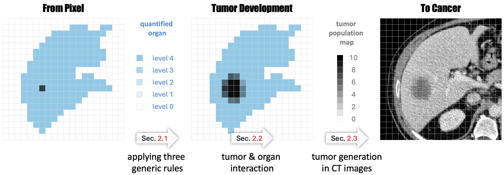

<h1 align="center">Pixel2Cancer</h1>
<h3 align="center" style="font-size: 20px; margin-bottom: 4px">Cellular Automata in Computed Tomography</h3>
<p align="center">
    <a href='https://www.cs.jhu.edu/~alanlab/Pubs24/lai2024pixel.pdf'></a> 
    <br/>
    <a href="https://github.com/MrGiovanni/Pixel2Cancer"></a>
    <a href="https://twitter.com/bodymaps317"></a>
</p>

This repository provides the code and checkpoints for our novel tumor synthesis approach, Pixel2Cancer, which can simulate tumor development within organs with realistic texture, shape, and interactions with other tissues.



## Paper

<b>From Pixel to Cancer: Cellular Automata in Computed Tomography</b> <br/>
[Yuxiang Lai](https://scholar.google.com/citations?hl=en&user=0hFskFkAAAAJ)<sup>1,2</sup>, [Xiaoxi Chen](https://scholar.google.com/citations?hl=en&user=FQ53_nAAAAAJ)<sup>3</sup>, [Angtian Wang](https://scholar.google.com/citations?user=YR7re-cAAAAJ&hl=en&oi=ao)<sup>1</sup>, [Alan L. Yuille](https://www.cs.jhu.edu/~ayuille/)<sup>1</sup>, and [Zongwei Zhou](https://www.zongweiz.com/)<sup>1,*</sup> <br/>
<sup>1 </sup>Johns Hopkins University  <br/>
<sup>2 </sup>Southeast University,  <br/>
<sup>3 </sup>University of Illinois Urbana-Champaign <br/>
International Conference on Medical Image Computing and Computer Assisted Intervention (MICCAI 2024; Early Accept) <br/>
[paper](https://www.cs.jhu.edu/~alanlab/Pubs24/lai2024pixel.pdf) | [code](https://github.com/MrGiovanni/Pixel2Cancer/tree/main)

**We have summarized publications related to tumor synthesis in [Awesome Synthetic Tumors](https://github.com/MrGiovanni/SyntheticTumors/blob/main/AWESOME.md) [](https://awesome.re).**

## Model
<div style="display:flex; justify-content:space-between;">

| Organ | Tumor | Model               | Pre-trained? | Download |          
|-------     |-------|---------------------|--------------|----------|
| liver | real  | unet                | no           | [link](https://huggingface.co/MrGiovanni/Pixel2Cancer/tree/main/liver/real/real.liver.no_pretrain.unet) |
| liver | real  | swin_unetrv2_base  | no           | [link](https://huggingface.co/MrGiovanni/Pixel2Cancer/tree/main/liver/real/real.liver.no_pretrain.swin_unetrv2_base) |
| liver | synt  | unet                | no           | [link](https://huggingface.co/MrGiovanni/Pixel2Cancer/tree/main/liver/synt/synt.liver.no_pretrain.unet) |
| liver | synt  | swin_unetrv2_base  | no           | [link](https://huggingface.co/MrGiovanni/Pixel2Cancer/tree/main/liver/synt/synt.liver.no_pretrain.swin_unetrv2_base) |
| pancreas | real  | unet                | no           | [link](https://huggingface.co/MrGiovanni/Pixel2Cancer/tree/main/pancreas/real/real.pancreas.no_pretrain.unet) |
| pancreas | real  | swin_unetrv2_base  | no           | [link](https://huggingface.co/MrGiovanni/Pixel2Cancer/tree/main/pancreas/real/real.pancreas.no_pretrain.swin_unetrv2_base) |
| pancreas | synt  | unet                | no           | [link](https://huggingface.co/MrGiovanni/Pixel2Cancer/tree/main/pancreas/synt/synt.pancreas.no_pretrain.unet) |
| pancreas | synt  | swin_unetrv2_base  | no           | [link](https://huggingface.co/MrGiovanni/Pixel2Cancer/tree/main/pancreas/synt/synt.pancreas.no_pretrain.swin_unetrv2_base) |
| kidney | real  | unet                | no           | [link](https://huggingface.co/MrGiovanni/Pixel2Cancer/tree/main/kidney/real/real.kidney.no_pretrain.unet) |
| kidney | real  | swin_unetrv2_base  | no           | [link](https://huggingface.co/MrGiovanni/Pixel2Cancer/tree/main/kidney/real/real.kidney.no_pretrain.swin_unetrv2_base) |
| kidney | synt  | unet                | no           | [link](https://huggingface.co/MrGiovanni/Pixel2Cancer/tree/main/kidney/synt/synt.kidney.no_pretrain.unet) |
| kidney | synt  | swin_unetrv2_base  | no           | [link](https://huggingface.co/MrGiovanni/Pixel2Cancer/tree/main/kidney/synt/synt.kidney.no_pretrain.swin_unetrv2_base) |

**You can download other materials from these links:**

All other checkpoints: [link](https://huggingface.co/MrGiovanni/Pixel2Cancer/tree/main)

Data: Liver ([link](https://www.dropbox.com/scl/fi/ulok1xpk5e6nzicfipqxd/04_LiTS.tar.gz?rlkey=amo7x516if5m85x13q2iddgpj&dl=0)), Kidney ([link](https://www.dropbox.com/scl/fi/i7gzoocjnxyrqiavwuwp1/05_KiTS.tar.gz?rlkey=02mxa8f9sabcpe1858ww9580o&dl=0)), Pancreas ([link](https://www.dropbox.com/scl/fi/p35mz72vnvc01epdhr95r/Task07_Pancreas.tar.gz?rlkey=9z6grnqt6dpmh5yzz299g3wqx&dl=0))


## 0. Installation

```bash
git clone https://github.com/MrGiovanni/Pixel2Cancer.git
cd Pixel2Cancer/
# download pre-trained models
wget https://github.com/Project-MONAI/MONAI-extra-test-data/releases/download/0.8.1/model_swinvit.pt
```

See [installation instructions](INSTALL.md) to create an environment and obtain requirements.


## 1. Train segmentation models using synthetic tumors

```bash
datapath=/mnt/zzhou82/PublicAbdominalData/

# UNET (no.pretrain)
CUDA_VISIBLE_DEVICES=0,1,2,3 python -W ignore main.py --optim_lr=4e-4 --batch_size=2 --lrschedule=warmup_cosine --optim_name=adamw --model_name=unet --val_every=200 --max_epochs=2000 --save_checkpoint --workers=0 --noamp --distributed --dist-url=tcp://127.0.0.1:12235 --cache_num=200 --val_overlap=0.5 --syn --logdir="runs/synt.no_pretrain.unet" --train_dir $datapath --val_dir $datapath --json_dir datafolds/healthy.json

# Swin-UNETR-Base (pretrain)
CUDA_VISIBLE_DEVICES=0,1,2,3 python -W ignore main.py --optim_lr=4e-4 --batch_size=2 --lrschedule=warmup_cosine --optim_name=adamw --model_name=swin_unetrv2 --swin_type=base --val_every=200 --max_epochs=2000 --save_checkpoint --workers=0 --noamp --distributed --dist-url=tcp://127.0.0.1:12231 --cache_num=200 --val_overlap=0.5 --syn --logdir="runs/synt.pretrain.swin_unetrv2_base" --train_dir $datapath --val_dir $datapath --json_dir datafolds/healthy.json --use_pretrained

# Swin-UNETR-Base (no.pretrain)
CUDA_VISIBLE_DEVICES=0,1,2,3 python -W ignore main.py --optim_lr=4e-4 --batch_size=2 --lrschedule=warmup_cosine --optim_name=adamw --model_name=swin_unetrv2 --swin_type=base --val_every=200 --max_epochs=2000 --save_checkpoint --workers=0 --noamp --distributed --dist-url=tcp://127.0.0.1:12231 --cache_num=200 --val_overlap=0.5 --syn --logdir="runs/synt.no_pretrain.swin_unetrv2_base" --train_dir $datapath --val_dir $datapath --json_dir datafolds/healthy.json

# Swin-UNETR-Small (no.pretrain)
CUDA_VISIBLE_DEVICES=0,1,2,3 python -W ignore main.py --optim_lr=4e-4 --batch_size=2 --lrschedule=warmup_cosine --optim_name=adamw --model_name=swin_unetrv2 --swin_type=small --val_every=200 --max_epochs=2000 --save_checkpoint --workers=0 --noamp --distributed --dist-url=tcp://127.0.0.1:12233 --cache_num=200 --val_overlap=0.5 --syn --logdir="runs/synt.no_pretrain.swin_unetrv2_small" --train_dir $datapath --val_dir $datapath --json_dir datafolds/healthy.json

# Swin-UNETR-Tiny (no.pretrain)
CUDA_VISIBLE_DEVICES=0,1,2,3 python -W ignore main.py --optim_lr=4e-4 --batch_size=2 --lrschedule=warmup_cosine --optim_name=adamw --model_name=swin_unetrv2 --swin_type=tiny --val_every=200 --max_epochs=2000 --save_checkpoint --workers=0 --noamp --distributed --dist-url=tcp://127.0.0.1:12234 --cache_num=200 --val_overlap=0.5 --syn --logdir="runs/synt.no_pretrain.swin_unetrv2_tiny" --train_dir $datapath --val_dir $datapath --json_dir datafolds/healthy.json
```

## 2. Train segmentation models using real tumors (for comparison)
```bash
datapath=/mnt/zzhou82/PublicAbdominalData/

# UNET (no.pretrain)
CUDA_VISIBLE_DEVICES=0,1,2,3 python -W ignore -W ignore main.py --optim_lr=4e-4 --batch_size=2 --lrschedule=warmup_cosine --optim_name=adamw --model_name=unet --val_every=200 --val_overlap=0.5 --max_epochs=2000 --save_checkpoint --workers=2 --noamp --distributed --dist-url=tcp://127.0.0.1:12235 --cache_num=200 --logdir="runs/real.no_pretrain.unet" --train_dir $datapath --val_dir $datapath --json_dir datafolds/lits.json

# Swin-UNETR-Base (pretrain)
CUDA_VISIBLE_DEVICES=0,1,2,3 python -W ignore -W ignore main.py --optim_lr=4e-4 --batch_size=2 --lrschedule=warmup_cosine --optim_name=adamw --model_name=swin_unetrv2 --swin_type=base --val_every=200 --val_overlap=0.5 --max_epochs=2000 --save_checkpoint --workers=2 --noamp --distributed --dist-url=tcp://127.0.0.1:12231 --cache_num=200 --logdir="runs/real.pretrain.swin_unetrv2_base" --train_dir $datapath --val_dir $datapath --json_dir datafolds/lits.json --use_pretrained

# Swin-UNETR-Base (no.pretrain)
CUDA_VISIBLE_DEVICES=0,1,2,3 python -W ignore -W ignore main.py --optim_lr=4e-4 --batch_size=2 --lrschedule=warmup_cosine --optim_name=adamw --model_name=swin_unetrv2 --swin_type=base --val_every=200 --val_overlap=0.5 --max_epochs=2000 --save_checkpoint --workers=2 --noamp --distributed --dist-url=tcp://127.0.0.1:12232 --cache_num=200 --logdir="runs/real.no_pretrain.swin_unetrv2_base" --train_dir $datapath --val_dir $datapath --json_dir datafolds/lits.json

# Swin-UNETR-Small (no.pretrain)
CUDA_VISIBLE_DEVICES=0,1,2,3 python -W ignore -W ignore main.py --optim_lr=4e-4 --batch_size=2 --lrschedule=warmup_cosine --optim_name=adamw --model_name=swin_unetrv2 --swin_type=small --val_every=200 --val_overlap=0.5 --max_epochs=2000 --save_checkpoint --workers=2 --noamp --distributed --dist-url=tcp://127.0.0.1:12233 --cache_num=200 --logdir="runs/real.no_pretrain.swin_unetrv2_small" --train_dir $datapath --val_dir $datapath --json_dir datafolds/lits.json

# Swin-UNETR-Tiny (no.pretrain)
CUDA_VISIBLE_DEVICES=0,1,2,3 python -W ignore -W ignore main.py --optim_lr=4e-4 --batch_size=2 --lrschedule=warmup_cosine --optim_name=adamw --model_name=swin_unetrv2 --swin_type=tiny --val_every=200 --val_overlap=0.5 --max_epochs=2000 --save_checkpoint --workers=2 --noamp --distributed --dist-url=tcp://127.0.0.1:12234 --cache_num=200 --logdir="runs/real.no_pretrain.swin_unetrv2_tiny" --train_dir $datapath --val_dir $datapath --json_dir datafolds/lits.json
```
## 3. Evaluation

#### AI model trained by synthetic tumors
```bash
datapath=/mnt/zzhou82/PublicAbdominalData/

# UNET (no.pretrain)
CUDA_VISIBLE_DEVICES=0 python -W ignore validation.py --model=unet --val_overlap=0.75 --val_dir $datapath --json_dir datafolds/lits.json --log_dir runs/synt.no_pretrain.unet --save_dir out
# Swin-UNETR-Base (pretrain)
CUDA_VISIBLE_DEVICES=0 python -W ignore validation.py --model=swin_unetrv2 --swin_type=base --val_overlap=0.75 --val_dir $datapath --json_dir datafolds/lits.json --log_dir runs/synt.pretrain.swin_unetrv2_base --save_dir out
# Swin-UNETR-Base (no.pretrain)
CUDA_VISIBLE_DEVICES=0 python -W ignore validation.py --model=swin_unetrv2 --swin_type=base --val_overlap=0.75 --val_dir $datapath --json_dir datafolds/lits.json --log_dir runs/synt.no_pretrain.swin_unetrv2_base --save_dir out
# Swin-UNETR-Small (no.pretrain)
CUDA_VISIBLE_DEVICES=0 python -W ignore validation.py --model=swin_unetrv2 --swin_type=small --val_overlap=0.75 --val_dir $datapath --json_dir datafolds/lits.json --log_dir runs/synt.no_pretrain.swin_unetrv2_small --save_dir out
# Swin-UNETR-Tiny (no.pretrain)
CUDA_VISIBLE_DEVICES=0 python -W ignore validation.py --model=swin_unetrv2 --swin_type=tiny --val_overlap=0.75 --val_dir $datapath --json_dir datafolds/lits.json --log_dir runs/synt.no_pretrain.swin_unetrv2_tiny --save_dir out
```

#### AI model trained by real tumors
```bash
datapath=/mnt/zzhou82/PublicAbdominalData/

# UNET (no.pretrain)
CUDA_VISIBLE_DEVICES=0 python -W ignore validation.py --model=unet --val_overlap=0.75 --val_dir $datapath --json_dir datafolds/lits.json --log_dir runs/real.no_pretrain.unet --save_dir out
# Swin-UNETR-Base (pretrain)
CUDA_VISIBLE_DEVICES=0 python -W ignore validation.py --model=swin_unetrv2 --swin_type=base --val_overlap=0.75 --val_dir $datapath --json_dir datafolds/lits.json --log_dir runs/real.pretrain.swin_unetrv2_base --save_dir out
# Swin-UNETR-Base (no.pretrain)
CUDA_VISIBLE_DEVICES=0 python -W ignore validation.py --model=swin_unetrv2 --swin_type=base --val_overlap=0.75 --val_dir $datapath --json_dir datafolds/lits.json --log_dir runs/real.no_pretrain.swin_unetrv2_base --save_dir out
# Swin-UNETR-Small (no.pretrain)
CUDA_VISIBLE_DEVICES=0 python -W ignore validation.py --model=swin_unetrv2 --swin_type=small --val_overlap=0.75 --val_dir $datapath --json_dir datafolds/lits.json --log_dir runs/real.no_pretrain.swin_unetrv2_small --save_dir out
# Swin-UNETR-Tiny (no.pretrain)
CUDA_VISIBLE_DEVICES=0 python -W ignore validation.py --model=swin_unetrv2 --swin_type=tiny --val_overlap=0.75 --val_dir $datapath --json_dir datafolds/lits.json --log_dir runs/real.no_pretrain.swin_unetrv2_tiny --save_dir out
```

## Data Setting
#### Train on 9k data of AbdominalAtlas1.1:
The release of AbdomenAtlas 1.0 can be found at [https://huggingface.co/datasets/AbdomenAtlas/AbdomenAtlas_1.0_Mini](https://huggingface.co/datasets/AbdomenAtlas/AbdomenAtlas_1.0_Mini)
```bash
# AbdominalAtlas1.1 training data list
# Liver 
--json_dir /datafolds/Bodymap/Atlas9k_liver/Atlas9k_liver_fold0.json
--json_dir /datafolds/Bodymap/Atlas9k_liver/Atlas9k_liver_fold1.json
--json_dir /datafolds/Bodymap/Atlas9k_liver/Atlas9k_liver_fold2.json
--json_dir /datafolds/Bodymap/Atlas9k_liver/Atlas9k_liver_fold3.json
--json_dir /datafolds/Bodymap/Atlas9k_liver/Atlas9k_liver_fold4.json
#Pancreas
--json_dir /datafolds/Bodymap/Atlas9k_liver/Atlas9k_pancreas_fold0.json
--json_dir /datafolds/Bodymap/Atlas9k_liver/Atlas9k_pancreas_fold1.json
--json_dir /datafolds/Bodymap/Atlas9k_liver/Atlas9k_pancreas_fold2.json
--json_dir /datafolds/Bodymap/Atlas9k_liver/Atlas9k_pancreas_fold3.json
--json_dir /datafolds/Bodymap/Atlas9k_liver/Atlas9k_pancreas_fold4.json
#Kidney
--json_dir /datafolds/Bodymap/Atlas9k_liver/Atlas9k_kidney_fold0.json
--json_dir /datafolds/Bodymap/Atlas9k_liver/Atlas9k_kidney_fold1.json
--json_dir /datafolds/Bodymap/Atlas9k_liver/Atlas9k_kidney_fold2.json
--json_dir /datafolds/Bodymap/Atlas9k_liver/Atlas9k_kidney_fold3.json
--json_dir /datafolds/Bodymap/Atlas9k_liver/Atlas9k_kidney_fold4.json
```

#### Train on public data & Intern experiments:

```bash
# Public training data list
# Liver
--json_dir /datafolds/5_fold/liver/liver_tumor_0.json
--json_dir /datafolds/5_fold/liver/liver_tumor_1.json
--json_dir /datafolds/5_fold/liver/liver_tumor_2.json
--json_dir /datafolds/5_fold/liver/liver_tumor_3.json
--json_dir /datafolds/5_fold/liver/liver_tumor_4.json
# Pancreas
--json_dir /datafolds/5_fold/pancreas/pancreas_tumor_0.json
--json_dir /datafolds/5_fold/pancreas/pancreas_tumor_1.json
--json_dir /datafolds/5_fold/pancreas/pancreas_tumor_2.json
--json_dir /datafolds/5_fold/pancreas/pancreas_tumor_3.json
--json_dir /datafolds/5_fold/pancreas/pancreas_tumor_4.json
# Kidney
--json_dir /datafolds/5_fold/kidney/kidney_tumor_0.json
--json_dir /datafolds/5_fold/kidney/kidney_tumor_1.json
--json_dir /datafolds/5_fold/kidney/kidney_tumor_2.json
--json_dir /datafolds/5_fold/kidney/kidney_tumor_3.json
--json_dir /datafolds/5_fold/kidney/kidney_tumor_4.json
```


## Acknowledgement

This work was supported by the Lustgarten Foundation for Pancreatic Cancer Research and the McGovern Foundation. The segmentation backbone is based on [Swin UNETR](https://github.com/Project-MONAI/tutorials/blob/main/3d_segmentation/swin_unetr_btcv_segmentation_3d.ipynb); we appreciate the effort of the [MONAI Team](https://monai.io/) to provide and maintain open-source code to the community.
